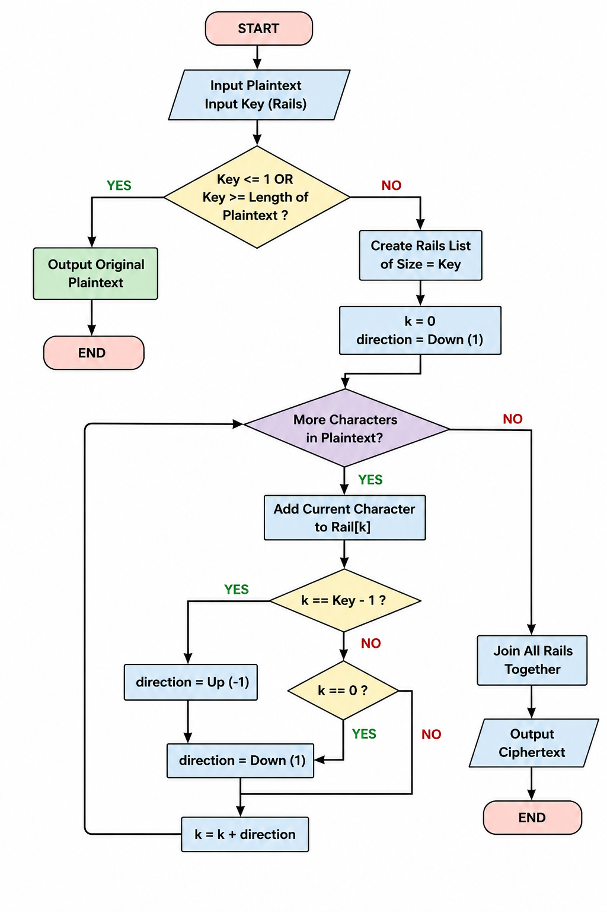

# Rail Fence Cipher Encryption Algorithm

## Objective

Encrypt a plaintext message using the Rail Fence Cipher by arranging characters in a zig-zag pattern across multiple rails and then reading the rails row-by-row.

---

## Input

* Plaintext message
* Number of rails (key)

---

## Output

* Rail Fence encrypted ciphertext

---

## Algorithm

1. Accept the plaintext message from the user.
2. Accept the number of rails (key).
3. If the key is less than or equal to 1, or greater than or equal to the length of the plaintext, return the original plaintext.
4. Create a list containing empty strings equal to the number of rails.
5. Initialize:

   * Current rail index `k = 0`
   * Direction `= 1` (moving downward)
6. For each character in the plaintext:

   * Append the character to the current rail.
   * If the current rail is the bottom rail:

     * Change direction to upward (`-1`).
   * Else if the current rail is the top rail:

     * Change direction to downward (`1`).
   * Move to the next rail according to the current direction.
7. After all characters have been placed, concatenate all rail strings from top to bottom.
8. Return the resulting ciphertext.

---

## Example

### Plaintext

HELLO

### Key

3

### Rail Arrangement

Rail 0:

H   O

Rail 1:

E L

Rail 2:

L

### Rails After Placement

Rail 0 = HO

Rail 1 = EL

Rail 2 = L

### Ciphertext

HOELL

---

## Time Complexity

O(n)

Where `n` is the length of the plaintext.

---

## Space Complexity

O(n)

Additional space is required to store the rails during encryption.

## Flowchart

